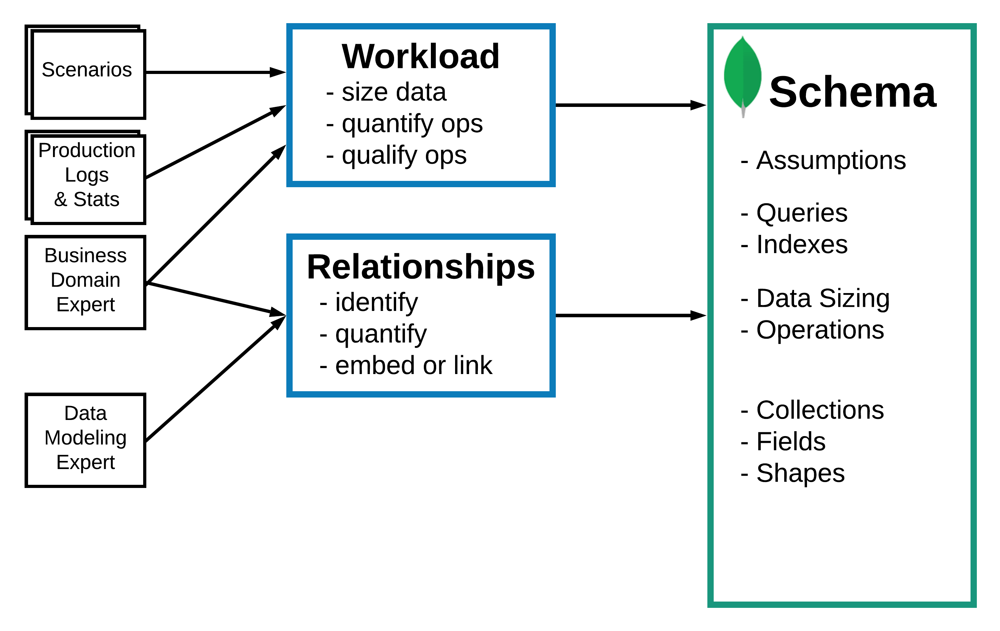

# Course 1 : M100

## Chapter 1 

### Lecture : MongoDB in Five Minutes

- data is stored in records called **documents**

- Features of MongoDB :
  -  Fault Tolerance : data stored across multiple servers (many copies)
  -  Scalability : scales across servers
  - Transparency : You can move data where you need it
  - MongoDB as a service (MongoDB Atlas) : available in AWS, azure ...

**The MongoDB query language is optimized to pull data from many collections at once.**

> This is **incorrect**.
>
> Pulling data from many collections, like Relational Databases Management Systems do, is inefficient.
>
> MongoDB uses the power of the Document Model to keep information that needs to be retrieved together in the same location.

### NoSQL Databases :

- 4 families of No SQL databases :
  - Key value :
    - key (primary key) points to the information
    - Database can be partitioned
    - Features :
      - Redundant Data on servers
      - Automatic  Failovers
      - Server Failures tolerance 
    - Limited access to Primary key
  - Graph : 
    - Relations within table 
    - SQL statements with self-joins
  - column oriented 
    - each data is stored in a column 
    - data is polymorphic
  - document oriented
    - Polymorphic data structures
    - Obvious relationships using embedded arrays and documents
    - Easy and natural representation
    - o complex mapping between application data and database

### Database Terminology

- Table -> collection 
- row -> Document
- column -> field

### The Document Model


- a Document : 
  - A way to organize and store data as a set of field-value pairs.
  - Similar to :
    - Dictionaries in Python
    - Maps in Java
    - JSON Object in JavaScript
  - Document model Constructs :
    - Fields (attributes)
    - Sub-documents(Nested Documents or Objects)
      - Allows to group information together (One to One Relationship)
    - Arrays 
      - Can contain values / objects (a One-to-Many Relationship)
- MongoDB uses what we call **BSON** (Binary JSON)
  - Physical storage of Document
  - `int`, `long`, `float`, `decimal` data types (JSON only supports `number`)

- Summary
  - models relationships with sub-document and arrays
  - keep the information used together stored together
  - map easily to the data structures of our code


### ACID with Transactions and Documents

- Atomicity : transactions are all or nothing
- Consistency : Only valid data is saved
- Isolation : Transactions do not affect each other
- Durability : Written data will not be lost

Example ACID in MongoDB : 

- Atomic :All writes to one document are done at once
- Consistency : no dependency on other documents
- Isolation : document being modified not seen by other reads
- Durability : guaranteed by doing a write with a "majority" concern

ACID with a MongoDB Transaction(action across multiple collections)

- Atomic : all writes to all documents are committed are once
- Consistency : all checks are done within the transaction
- Isolation : guaranteed through a "snapshot" isolation level
- Durability : guaranteed by default : the write has a "majority" concern.


**Summary** :

- Fewer transactions means minimal performance impact
- avoid long running transactions
- Prefer the Document Model to limit updates to a single document to achieve ACID, over transactions

### Distributed Database Considerations

- many servers
- process need to talk to each other
- network speed

- Common Deployments : 
  - Replica  Set :
    - a Set of Servers (commonly 3 servers ) that each have a complete copy of the DB (high availability + data availability)
    - from now and then an election of the primary node (primary server of the 3) will be held automatically
  - Sharded Cluster :
    - a Group of replica sets
      - used to :
        - partition a data set into many servers
        - placing data close to the users


### Read / Writes Operation Guarantees

- Contracts between the application and the database server on aspects like durability and staleness

- **Operation Guarantees/Configurations**
  - **Write concern** : the contract of durability between an application and a mongodb server where the writes happen
    - mongodb writes to the primary member of the replica or of the shards then the writes will be replicated to all members of a replica set automatically 
    - **Write concern of one** : waiting for the ack from the primary member
    - **Write concern of majority** : waiting for the ack from the secondary members
  - **Read concern** :
    - **Read  Concern local** : the application gets the latest information written to a node which it connect to 
    - **Read concern majority** : ...
  - **Read preference** : The default is to read from the primary node
    - **Read preference nearest** : read from the closest possible node to the application
    - Second type  : read from a dedicated node (for example analytics node )

- IMPORTANT : Mongodb always writes to the primary member of the replica set / of the shards
- you can use a global global clusters  to direct some write operations to a certain server (easy to deploy in )

SUMMARY : 

- `writeConcern` : is the durability guarantee of a write operation
- `readConcern` : is the guarantee that a read operation will get durable data
- `readPreference` : the preferred node to read from 

## Chapter 2 : Modeling for MongoDB

### Flexible Methodology for Data Modeling 

- Many ways to model data 
- Methodologies for :
  - conceptual model
  - logical model
  - physical model

- Emphasis on **Workload**
- **Simple Methodology** (3 phases)
  - phase 1 : description of the workload : size data , quantity ops , quality ops
    - **understand**  : what operations are modeling for 
    - **quantify and qualify** : read and write operations
    - **outputs** : list of operations
    - which of theses are the most important ones
  - phase 2 : identify Relationships( like an ER  diagram) : identify , quantify , embed or link
    - similar to relational modeling :
      - one-to-one  (generally on one document) 
      - one-to-many and many-to-many (either embedding in same document / link the documents)*
  - phase 3 : Apply patterns (like denormalization)
    - transformations : address performance, maintenance, or simplicity requirements


# Course 2 : M001

## Chapter 1 : What is MongoDB ?

### Atlas User Interface

- A cluster has a set of databases
- Each database has a couple of collections
- Each collections has documents, these documents can have different structures

- 0.0.0.0 will give access to **everyone** to the cluster.
- 2 ways to access data :
  - through the website (select cluster then click collections)
  - through the shell 


### In-Browser IDE

### How does MongoDB store data?

- Data is stored in BSON (not human readable) and visualized in JSON
  - offers speed , flexibility ... over JSON.

## Chapter 2 : Importing & Exporting

- **drop** clears the database before inserting

```shell
mongodump --uri "mongodb+srv://<your username>:<your password>@<your cluster>.mongodb.net/sample_supplies"

mongoexport --uri="mongodb+srv://<your username>:<your password>@<your cluster>.mongodb.net/sample_supplies" --collection=sales --out=sales.json

mongorestore --uri "mongodb+srv://<your username>:<your password>@<your cluster>.mongodb.net/sample_supplies"  --drop dump

mongoimport --uri="mongodb+srv://<your username>:<your password>@<your cluster>.mongodb.net/sample_supplies" --drop sales.json
```

### Data Explorer

#### Using Atlas UI

- Using the atlas UI , we go to collection
- we then select the wanted collection by searching `db_name.collection_name` and then write our filter to find the data

Example : 

```json
{"state":"NY", "city" : "ALBANY"}
```

This will return documents with matching state and city

#### Using Shell

> A fully functional JavaScript interpreter

- To select a Database : 

  ```
  use db_name
  ```

- To show Databases :

  ```
  show dbs
  ```

- To show collection in a specific Database

  ```
  show collections
  ```


### Find command

```shell
db.zips.find({"state": "NY"})
```

- `it` iterates through the cursor. (if it show 20 per page , `it` will show the next 20)

- To Count the number of documents in the result:

```shell
db.zips.find({"state": "NY"}).count()
```

- To prettify : 

```shell
db.zips.find({"state": "NY", "city": "ALBANY"}).pretty()
```


## Chapter 3  : Inserting New Documents 

### Inserting New Documents - ObjectId (Check M320 after this)

- ObjectId() : Gives unique value to `_id` (it is the default value unless otherwise specified)

### Inserting New Documents - insert() and errors

```shell
db.<collection-name>.insert({document});
```


- Final remarks : 
  - We can insert two duplicate documents, as long as the `_id` is different
  - if we don't provide a`_id` field, it will be automatically generated 

### Inserting New Documents - insert() order

- Inserting multiple documents

```
db.inspections.insert([ { doc1 }, { doc2 }, { doc3 } ])
```


#### ordered parameter

- This will insert test1 (is is sequential in the insertion, one error and it stops)

```
db.inspections.insert([{ "_id": 1, "test": 1 },{ "_id": 1, "test": 2 },
                       { "_id": 3, "test": 3 }])
```


- This will only insert test 3 (the only one without an error)

```
db.inspections.insert([{ "_id": 1, "test": 1 },{ "_id": 1, "test": 2 },
                       { "_id": 3, "test": 3 }],{ "ordered": false })
```


#### finals notes on insertion

- When we insert a document to a collection that doesn't exist, well it exists now !
- when the collection is created, the database is created also if it doesn't exist

### Updating Documents - Data Explorer

> EZ PZ

### Updating Documents - mongo shell

- `findOne()` : returns **one** document that matches the given query
- `updateOne()`: updates one document that matches the given query
- `updateMany()` : updates all documents matching query


#### Examples : 

- Increment a field

```shell
db.zips.updateMany({ "city": "HUDSON" }, { "$inc": { "pop": 10 } })
```

- Set the value of a field (if it doesn't exist, it gets created)

```sh
db.zips.updateOne({ "zip": "12534" }, { "$set": { "population": 17630 } })
```

- add and element to an array field :

```shell
db.grades.updateOne({ "student_id": 250, "class_id": 339 },
                    { "$push": { "scores": { "type": "extra credit","score": 100 }}})
```


### Deleting Documents and Collections

- `deleteOne()` : only useful when we're querying by `_id` (otherwise using it is very dangerous ).
- `deleteMany()`  : to delete many documents based on a query

- `db.<collection-name>.drop()`: Drops a collection 


## Chapter 4: Advanced CRUD Operations

### Query Operators - Comparison

#### update operators 

- $inc
- $set
- $unset

#### Query operators

- Provide additional ways to locate data within the database

####  Comparison operators

```json
{ <field>: { <operator>: <value>} }
```

- `$eq` (we can omit it ) and `$ne`
- `$gt` and `$lt`
- `$gte` and `$lte`

Examples

- In Atlas UI

```json
{"tripduration" : {"$lt": 70}}
{ "tripduration": { "$lte" : 70 },"usertype": { "$ne": "Subscriber" } }
```

- In Shell

```shell
db.trips.find({ "tripduration": { "$lte" : 70 },
                "usertype": { "$ne": "Subscriber" } }).pretty()
```

Example 2

```shell
db.trips.find({"birth year": {"$gt":1998}}).count() - db.trips.find({"birth year": 1998}).count()
```

### Query Operators - Logic

- $and , $or , $nor  ( $and is implicit most of the times ) : 
  - Syntax : `{ <operator> : [{statement1},{statement2},...] }`
- $not :
  - Syntax : `{ $not: { statement } }`


Examples 

```shell
db.routes.find({ "$and": [ { "$or" :[ { "dst_airport": "KZN" },
                                    { "src_airport": "KZN" }
                                  ] },
                          { "$or" :[ { "airplane": "CR2" },
                                     { "airplane": "A81" } ] }
                         ]}).pretty()
```

```shell
db.zips.find({ "pop" : {"$lt" : 1000000 ,"$gt": 5000}})
```

Challenging Example : 

```shell
db.companies.find({
	"$or" : [
	{"$and" : [ {"founded_year":2004}, {"$or" : [{"category_code":"web"},{"category_code":"social"}]}]},
	{"$and" : [ {"founded_month":10}, {"$or" : [{"category_code":"web"},{"category_code":"social"}]}]} ]        
	})
```

Same as : 

```shell
db.companies.find({
	"$and" : [ { "$or" : [{"founded_year":2004},{"founded_month":10}]} ,{ "$or" : [{"category_code":"web"},{"category_code":"social"}]}]}).count()
```


- $and is used as the default operator when an operator is not specified
- explicitly use $and when you need to include the same operator more than once in a query ; for example   `( ( a or b ) and ( c or d ) )`

### Expressive Query Operator

- $expr allows the use of aggregations expressions within the query 
  - Syntax : `{ $expr : { <expression }}`
- $expr allows us to use variables and conditional statements.

```json
{"$expr" : { "$eq" : [ "$start station id","$end station id"] }}
```

- `$` can also address the field value (like the example above) 


**Example:**

```sh
db.trips.find({ "$expr": { "$and": [ { "$gt": [ "$tripduration", 1200 ]},
                         { "$eq": [ "$end station id", "$start station id" ]}
                       ]}}).count()
```

MQL Syntax :

```json
{<field>: { <operator> : <value>}}
```

Aggregation Syntax : 

```json
{<operator>: { <field> : <value>}}
```

### Array Operators

- $push : 
  - adds element to an array
  - turns a field into an array field if it was previously a different type

- Look for documents where amenities array has exactly one element, shampoo

```json
{"amenities": ["Shampoo"]}
```

- Look for document where amenities array contains shampoo 

```json
{"amenities": "Shampoo"}
```

- Look for documents where amenities array contains **exactly** Shampoo **then** Soap **in that specific order** .

```json
{"amenities": ["Shampoo","Soap"]}
```

- Look for documents that have **at least** this elements in the amenities array 

```json
{"amenities": {"$all" : ["Shampoo","Soap"] } }
```

- query by **array length** (for this example array needs of size **exactly** 20 )

```json
{"amenities" : { "$size": 20 }}
```


- Examples : 

```shell
db.listingsAndReviews.find({ "$and" :[ {"reviews": {"$size" :50} },{"accommodates":{"$gt" : 6}}  ] })
```


```shell
db.listingsAndReviews.find({"$and":[{"property_type":"House"},{"amenities" : "Changing table"}] })
```

### Array Operators and Projection

- **Syntax of projection** (1: include field , 0: don't )

```shell
db.<collection>.find( { <query> }, { <projection> } )
```


- **Example** : show price and address , but don't show _id (because _id is always included by default , this is the only use case when we use 0 and 1 )

```shell
db.listingsAndReviews.find({ "amenities": "Wifi" },
                           { "price": 1, "address": 1, "_id": 0 }).pretty(
```


- `$elemMatch` : Condition on **sub-document**

  - Using projection (`"$elemMatch": { "score": { "$gt": 85 }` will return 0 or 1, so either it will projected with _id, or we get only _id)

    ```shell
    db.grades.find({ "class_id": 431 },
                   { "scores": { "$elemMatch": { "score": { "$gt": 85 } } }
                 }).pretty()
    ```

    

  - Not using Projection (matches all documents containing an array field matching the specified criteria )

    ```shell
    db.grades.find({ "scores": { "$elemMatch": { "type": "extra credit" } }
                   }).pretty()
    ```


### Array Operators and Sub-Documents

#### Dot Notation

- for an object

```shell
db.trips.findOne({ "start station location.type": "Point" })
```

- for an array : (`.0` : element with index 0 in the array )

```shell
db.companies.find({ "relationships.0.person.last_name": "Zuckerberg" },
                  { "name": 1 }).pretty()
```

To search in the whole array we use `$elemMatch` like we discussed before.

```shell
db.companies.find({ "relationships":
                      { "$elemMatch": { "is_past": true,
                                        "person.first_name": "Mark" } } },
                  { "name": 1 })
```


## Chapter 5 : Indexing and Aggregation Pipeline

### Aggregation Framework


- we use `aggregate` instead of `find` 

```shell
db.listingsAndReviews.aggregate([{ "$match": { "amenities": "Wifi" }},
                                 { "$project": { "price": 1,"address": 1,"_id": 0 }}]).pretty()
```


- order is important in an aggregation ( different stages ) , the example above has 2 stages , the `$match` stage and then the `$project` stage 


MQL : filter / update data

Aggregation framework : compute / reshape data


#### $group

- An operator that take the incoming data stream and siphons it into multiple distinct reservoir

- Important : Non-filtering stages do not modify the original data. instead, they work with the data in the cursor

```sh
{$group :{_id : <expression>, <field1>: { <accumulator1> : <expression1> }, } }
```

- Example 1 : without using acc1

```shell
db.listingsAndReviews.aggregate([{ "$project" : { "address":1,"_id":0 }}, {"$group" :{_id : "$address.country"} } ])
```

- Example 2 (adding count for each line)

```shell
db.listingsAndReviews.aggregate([{ "$project" : { "address":1,"_id":0 }}, {"$group" :{_id : "$address.country", "count": {"$sum":1}} } ])
```


#### sort() and limit()


- they are cursor methods  like `pretty()` and `count()`
- they are applied to the result set in the cursor

Examples 

```sh
# 1 for increasing, -1 for decreasing
db.zips.find().sort({ "pop": 1 }).limit(1)

db.zips.find({ "pop": 0 }).count()

db.zips.find().sort({ "pop": -1 }).limit(1)

db.zips.find().sort({ "pop": -1 }).limit(10)

db.zips.find().sort({ "pop": 1, "city": -1 })
```

### Introduction to Indexes

- an index : 
  - similar to an index in a book
  - a special data structure that stores a small portion of the collection's data in an east to traverse form

Examples 

```shell
# single field index
db.trips.createIndex({ "birth year": 1 })
# multiple field index
db.trips.createIndex({ "start station id": 1, "birth year": 1 })
# sort can be avoided in the request below, bcz we have an index already
db.trips.find({ "start station id": 476 }).sort( { "birth year": 1 } )
```


### Introduction to Data Modeling

- **Rule : Data is stored the wat that it is used** 
  - Everything that is queried together should be in the same collection, for optimization

### Upsert - Update or Insert?

#### Update Request : 

```sh
db.collection.updateOne({<query to late>}, {<update>})
```


#### Upsert (false by default)

```
db.collection.updateOne({<query to late>}, {<update>},{"upsert":true})
```

- this will insert the record if it doesn't exist ;

## Chapter 6: Next Steps

### Atlas Products and Options

- Each organization can have many projects
- Each project can have many clusters , each team is assigned to a project
- each cluster can have many databases, clusters should have unique names
- each database can have many collections
- each collection can have many documents


- **Charts** : To draw charts using the data
- **Realm** : similar to Firebase in some aspects.

### What is MongoDB Compass?

**Never Touch admin, config and local databases.**

- we need to add an index for each field / set of fields we search documents by .


- **Validation** tab : create new validations.
- **Explain plan** tab : shows how the query was executed, which indexes were used and how many documents it searched in  for the result.


# Course M320 : Data Modeling 

## Chapter 1 : Chapter 1: Introduction to Data Modeling

### Introduction to Data Modeling

> https://www.vertabelo.com/blog/crow-s-foot-notation/

### Data Modeling in MongoDB

- Structure -> Schema 

- Mongodb is **not** `schemaless`, as we go further we will find a general schema for our data, then we enforce some validation rules

- Storing everything in one gigantic document is sometimes not efficient. when many changes occur for example

- you can perform all kind of join in mongodb, with `$lookup`

  

### The Document Model in MongoDB

- MongoDB stores data as Documents
- Document fields can be values, embedded docs, arrays of values and documents
- MongoDB is a Flexible Schema database.

### Constraints in Data Modeling

- max size of document (16 MB ), atomicity of updates.
- Working Set : Frequently Accessed Documents and Indexes 


- **Tips :** 
  - Keep the frequently used Documents in RAM
  - keep the indexes in RAM
  - Prefer SSD to HDD
  - Infrequently data can use HDD

### The Data Modeling Methodology

1. Describe the workload : All there is to know about the data
2. Identify the relationships
3. Apply Design Patterns


#### 1.Describe the workload

- Workload :
  - size data
  - quantify operations
  - qualify operations 

#### 2.Identify the relationships

- Relationships :
  - identify
  - quantify
  - embed of link

#### 3.Apply Design Patterns

- Patterns : 
  - recognize
  - apply



### Model for Simplicity or Performance


### Identifying the Workload


## Chapter 2: Relationships

### Relationship Types and Cardinality

#### One to One

#### One to Many

#### One to Zillions

#### Many to Many

### One-to-Many Relationship

#### embed in the "one" side : 

- documents form the "many" side are embedded
- most common representation for : 
  - simple applications
  - few documents to embed
- in order to query from the embedded array , we **index** it.

#### embed, in the "many" side (Sounds weird ...)

- Example : **one** address **many** orders 
- less often used
- useful if "many" side is **queried more often** that one side
- embedded object is **duplicated** :
  - duplication may be preferable for dynamic objects

#### reference, in the "one side" 

- example : we create an **array of ids** on the one side
- cascade deletes are not supported and must be managed by the app

#### reference, in the "many" side

- **preferred** representation using references
- allows for large documents an a high count of these
- No need to manage the references on the "one" side.


**Recap :**

- Prefer embedding over referencing for **simplicity**, or when there is a **small number of referenced documents** as all related information is kept together.
- Embed on the side of **the most queried collection**
- Prefer referencing when the associated documents are not always needed with the most often queried documents


### Many-to-Many Relationship

  #### Embed

##### array of subdocuments in the main "many" side

- the documents from the less queried side are embedded
- results in duplication
- **keep "source" for the embedded documents in another collection**
  - For example , if you have a cart of items, in additions to the array of items embedded in the cart collection, we need another item collection. The point is, in case we delete the cart, all its items can be still used by other collection in the database (a source for it ) 
  - Do this for mainly static fields (if an item doesn't change much for example ), if they are dynamic, then it's not preferred.
- indexing is done on the array

##### array of subdocuments in the other "many" side

Usually, only the most queried side is considered

#### Reference

##### array of references in the main "many" side.

- array of references to the documents of the other collection
- references readily available upon first query on the "main" collection.

##### array of references in the other "many" side.

- array of references to the documents of the other collection
- need a second query to get more information


Recap :

- Ensure it is a "many-to-many" relationship that should not be simplified
- a "many-to-many" relationship can be replaced by two "one-to-many" relationships **but does not have to do with the document model**.
- Prefer embedding on **the most queried side**.
- Prefer embedding for information that is primarily static over time and may **profit from duplication**.
- Prefer referencing over embedding **to avoid managing duplication**.

### One-to-One Relationship

#### Embed

##### Fields at same level

- most common, similar to tabular databases

##### Grouping in sub-documents

- For example : group address to `shipping address` sub-document and `address` sub-document 
- **preferred representation** :
  - preserves simplicity
  - documents are clearer

#### Reference

##### same identifier in both documents

- Divide the fields into two collections, and create a reference between the two (`storeid` in both collections for example)
- Possible performance improvements with :
  - Smaller disk access.
  - Smaller amount of Ram needed.


**Recap :**

- Prefer embedding over referencing for simplicity
- Use subdocuments to organize the fields
- Use a reference for optimization purposes


### One-to-Zillions Relationship

we use only one representation : **Reference** in the "zillions" side

## Chapter 3: Patterns (Part 1)

### Handling Duplication, Staleness and Integrity

